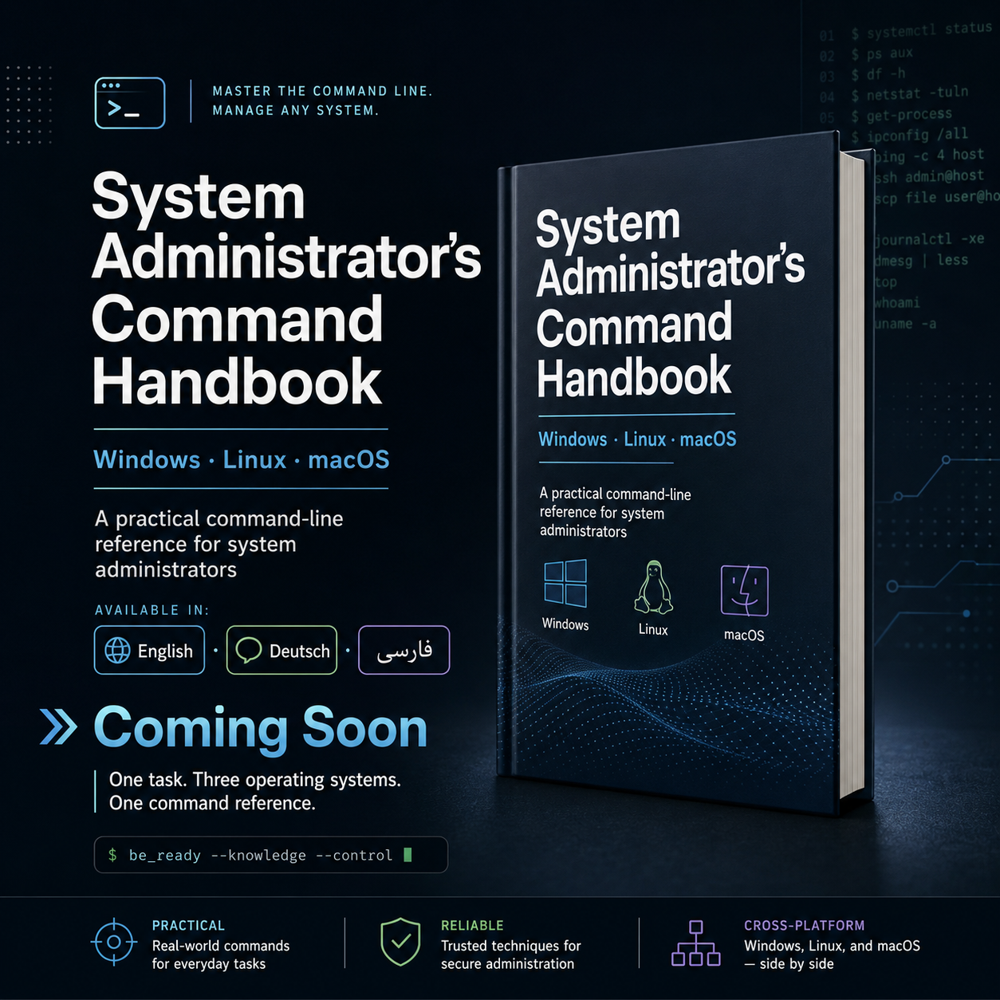

# System Administrator's Command Handbook

**Windows · PowerShell · Linux · macOS**

> One task. Three operating systems. One command reference.

  

A practical, cross-platform command-line reference for system administrators.

**Public release: Coming Soon**

---

## About the Project

**System Administrator's Command Handbook** is a task-oriented reference for administrators working across Windows, PowerShell, Linux, and macOS.

The project originally began in **2012** and reached its original completed edition in **2014**.

In **2026**, the project was reopened and completely reconstructed for modern system administration.

The 2026 edition is **not a reprint of the 2014 handbook**. It is a re-engineering of the original concept, with a modern technical baseline, expanded platform coverage, updated administration tools, cross-platform comparisons, lifecycle information, operational guidance, and safety considerations.

---

## Project Timeline

**2012 — Initial Version**  
The first version of the command-reference project was created.

**2014 — Original Final Edition**  
The original handbook reached its completed form based on the system-administration landscape of that period.

**2026 — Complete Reconstruction**  
The project was redesigned and technically rebuilt for modern Windows, PowerShell, Linux, and macOS administration.

See the full [Changelog](CHANGELOG.md).

---

## Core Idea

Traditional command references often begin with a command name.

This handbook begins with the **administrative task**.

The goal is to help answer questions such as:

- Which tool should I use for this task?
- What is the equivalent on another operating system?
- Is this command still current?
- Does it require administrative privileges?
- Is the operation potentially destructive?
- What should be checked before using it in production?

---

## Platform Coverage

| Platform | Coverage |
| --- | --- |
| Windows | CMD, native administration tools, Windows Server utilities |
| PowerShell | Administration, objects, pipelines, remoting and automation |
| Linux | Bash, GNU/Linux tools, systemd, networking, storage and security |
| macOS | zsh and native administration tools |

---

## Major Coverage Areas

- Shell Fundamentals & Automation
- Files, Directories, Text & Data
- Users, Groups, Permissions & Identity
- Processes, Services & Sessions
- Storage, Filesystems & Backup
- Networking, DNS & Remote Administration
- Software, Packages, Updates & Deployment
- Logs, Performance, Inventory & Diagnostics
- Security, PKI, Encryption & Access Control
- Scheduling & Automation
- Active Directory & Enterprise Administration
- Native macOS Administration

---

## More Than Syntax

Depending on the tool, handbook entries may include:

- Purpose and administrative context
- Syntax
- Practical administrator examples
- Privilege requirements
- Operational guidance
- Safety considerations
- Version and platform notes
- Cross-platform equivalents
- Authoritative references
- Tool lifecycle status

### Lifecycle Status

**Current · Legacy · Deprecated · Removed**

The handbook distinguishes between tools that merely still exist and tools that should actually be selected for modern administration.

---

## Cross-Platform by Design

| Administrative Task | Windows | PowerShell | Linux | macOS |
| --- | --- | --- | --- | --- |
| List processes | `tasklist` | `Get-Process` | `ps` | `ps` |
| Manage services | `sc.exe` | `Get-Service` | `systemctl` | `launchctl` |
| Inspect network configuration | `ipconfig` | `Get-NetIPConfiguration` | `ip` | `networksetup` |
| Manage disks | `diskpart` | Storage cmdlets | `lsblk` / `parted` | `diskutil` |
| Query DNS | `nslookup` | `Resolve-DnsName` | `dig` | `dig` |
| Inspect TCP connections | `netstat` | `Get-NetTCPConnection` | `ss` | `netstat` |

---

## Editions

### English
**System Administrator's Command Handbook**

### Deutsch
**Das Kommandozeilen-Handbuch für Systemadministratoren**

### فارسی
**راهنمای جامع دستورات برای مدیران سیستم**

All three editions follow the same underlying technical architecture.

---

## Publication Status

| Edition | Status |
| --- | --- |
| English | Coming Soon |
| Deutsch | Coming Soon |
| فارسی | Coming Soon |

---

## Companion Resources

### Quick References

- [Service Management](quick-reference/services.md)
- [Networking & DNS](quick-reference/networking.md)
- [Storage & Filesystems](quick-reference/storage.md)
- [Processes & Diagnostics](quick-reference/processes.md)
- [Users & Permissions](quick-reference/users-permissions.md)
- [Logs & Diagnostics](quick-reference/logs-diagnostics.md)
- [Security & Access Control](quick-reference/security.md)

### Technical Updates

- [Windows](updates/windows.md)
- [PowerShell](updates/powershell.md)
- [Linux](updates/linux.md)
- [macOS](updates/macos.md)

### Language Companion Pages

- [English](docs/english/README.md)
- [Deutsch](docs/deutsch/README.md)
- [فارسی](docs/persian/README.md)

---

## Errata & Corrections

Operating systems evolve. Commands may be deprecated, replaced, removed, or change behavior after a printed edition is released.

Verified corrections and important platform changes are documented in [ERRATA.md](ERRATA.md).

Please read [CONTRIBUTING.md](CONTRIBUTING.md) before submitting a technical correction.

---

## About This Repository

This repository is the **official public companion repository** for the handbook.

It provides cross-platform quick references, selected administrative examples, technical updates, errata and corrections, version notes, and supporting administration resources.

The complete publication manuscript and print-production files are **not distributed through this repository**.

---

## Website

The official project landing page will contain the complete project history, publication information, language editions, release status, and future purchase links.

**Website: Coming Soon**

---

## Author

**Soroush Neyestani**

---

## Licensing

Different parts of this repository use different licensing terms. See [LICENSE.md](LICENSE.md).

---

## Public Release

**Coming Soon**

English · Deutsch · فارسی

---

**One task. Three operating systems. One command reference.**
